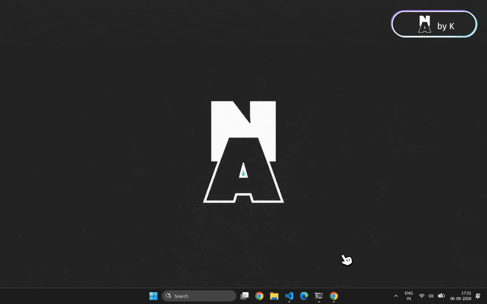
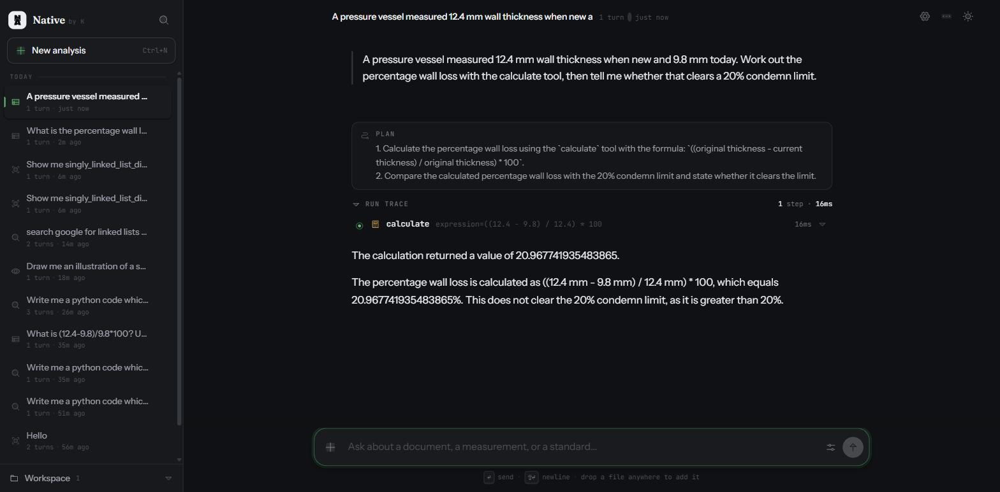
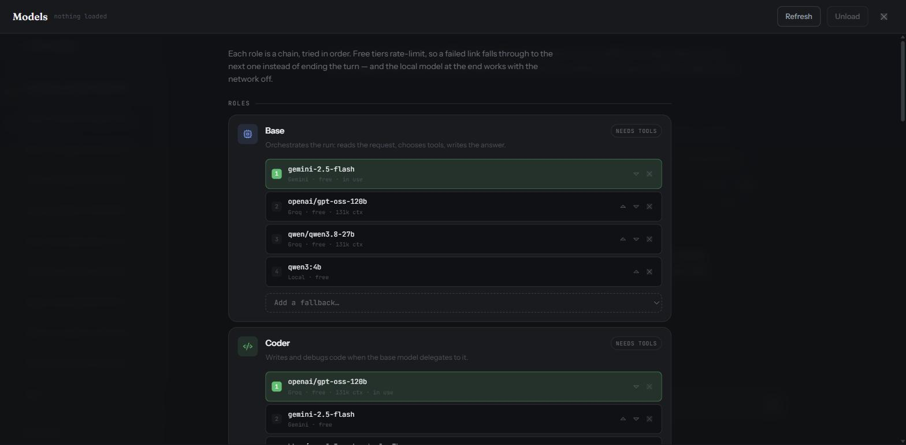
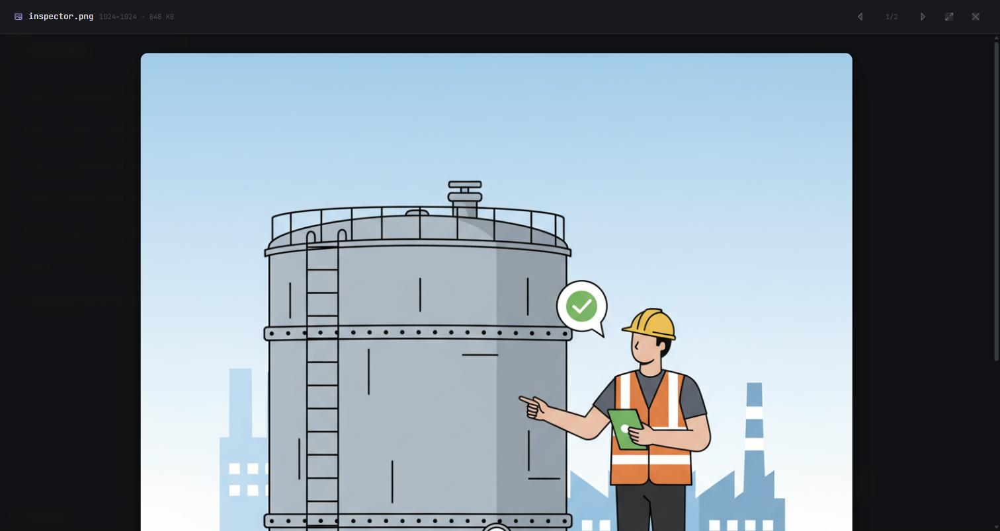

<p align="center">
  
</p>

<p align="center">
  <a href="#setup">Setup</a> ·
  <a href="#what-it-does">What it does</a> ·
  <a href="#how-it-works">How it works</a> ·
  <a href="docs/limitations.md">Limitations</a>
</p>

<p align="center">
  
  
  
  
</p>

---

An agent you run yourself. It reads your documents, executes code in a sealed
container, searches your knowledge base, drives a real browser, and writes
the Word, Excel and PowerPoint files you actually have to hand over.

The models come from whichever free tiers you have keys for — Groq, Gemini,
OpenRouter, NVIDIA — with Ollama on your own machine at the end of every chain.
When a free tier rate-limits, the run does not stop; it moves down the chain and
keeps going. That is the whole design.

<p align="center">
  
</p>
<p align="center"><sub>One run, start to finish: a question goes in, the plan appears, each tool call runs in the open, and the file it produced is opened from disk.</sub></p>

## Why it exists

Most agent front-ends ask you to trust a summary. This one is built the other
way round: the run trace is the primary content, and the answer is what is left
once you can see how it was reached. Every tool call is on screen with its
arguments, its duration and its raw result, and every file the agent writes is
re-opened and described back from disk rather than from the code that wrote it.

<p align="center">
  
</p>
<p align="center"><sub>Every run shows its working: what it planned, which tool it called with which arguments, how long that took, and what came back.</sub></p>

It also has to be free to run all day. A single free tier is not an everyday
assistant — it is an assistant that stops working at two in the afternoon. So
roles are chains rather than choices, and the last link is a model on your own
hardware that has no quota at all.

## What it does

<table>
<tr><td width="30%"><b>Reads what you give it</b></td><td>PDFs with a text layer, scans and photographs through OCR, spreadsheets range by range, images through a vision model. Drop a file anywhere in the window.</td></tr>
<tr><td width="30%"><b>Runs code for real</b></td><td>Python in a Docker container with the network stack disabled at the kernel level, a memory cap and a wall-clock timeout. Not a sandboxed interpreter — a sealed one.</td></tr>
<tr><td width="30%"><b>Writes what you hand over</b></td><td><code>.docx</code>, <code>.xlsx</code> and designed 16:9 <code>.pptx</code> — section dividers, banded tables, headline-figure cards, pull quotes, full-bleed images, in one of five palettes. Then it reopens each file and reports its real contents — row counts, value ranges, slide titles — so the summary cannot drift from the artifact.</td></tr>
<tr><td width="30%"><b>Searches your own documents</b></td><td>A local embedding model indexes your knowledge base. Documents never leave the machine, whichever provider answers the question.</td></tr>
<tr><td width="30%"><b>Researches, when you ask it to</b></td><td>A second run mode. It plans the sub-questions, reads sources one at a time, and writes each into a notebook on disk the moment it reads it — so twenty-five sources are all still legible at the end, and the answer cites <code>[S1]</code>, <code>[S7]</code> against lines you can check.</td></tr>
<tr><td width="30%"><b>Draws, or finds</b></td><td>Generated images through Gemini for illustrations and diagrams; real photographs pulled off the web when the picture has to be genuine — with the licence, if you ask for reusable ones. Both land in the workspace, where the viewer, the report writer and the deck builder pick them up the same way.</td></tr>
<tr><td width="30%"><b>Drives a real browser</b></td><td>A Chrome window that opens on your screen and stays open between steps, holding its cookies and its logins — so it can sign in, fill and submit a form, and read pages that only exist after their own JavaScript has run. You watch it happen and can stop it. Needs <a href="https://github.com/steel-dev/steel-browser">Steel</a> running.</td></tr>
<tr><td width="30%"><b>Shows you things</b></td><td>Images open in the app, beside the conversation. Everything else opens in the application your machine uses for it.</td></tr>
</table>

<table>
<tr>
<td width="50%"></td>
<td width="50%"></td>
</tr>
<tr>
<td><sub><b>Roles are chains.</b> Each one is tried in order, free tiers first, local last. Reorder them, or drop a link.</sub></td>
<td><sub><b>Images stay in the app.</b> Arrow keys move through everything in the workspace.</sub></td>
</tr>
</table>

## How it works


The router walks a role's chain and takes the first model that answers. A rate
limit, a retired model, an auth failure or a timeout moves to the next link; a
malformed request does not, because every provider would reject it identically.

### Two run modes

The control sits on the composer, next to send, because the mode is a per-turn
choice rather than a property of the conversation — switch it mid-thread and
only the next turn changes.

| | |
|---|---|
| **Standard** | Answers directly, reaching for tools when it needs them. Every ordinary turn. |
| **Research** | Plans the sub-questions, then searches, reads and takes notes on one source at a time until the checklist is covered — at least twelve sources, twenty-odd for a broad topic — and answers from the notebook. Slow, on purpose. |

Research mode exists because of a specific failure. The context window is
trimmed to a recent slice on every turn, so by the twentieth source the first
fifteen have scrolled out of the model's reach, and what it writes then is a
summary of the last few pages and a *memory* of the rest. So the notes do not
live in the conversation: each source is appended to a markdown file in the
workspace the moment it is read, numbered `[S1]`, `[S2]` … with its URL beside
it. The model re-reads that file before it writes, rather than remembering it.

Which makes the citations real. `[S7]` resolves to a line in a file on your
disk that names the page it came from — so a claim in the answer can be
checked, which is the same reason the run trace exists at all.

### What it remembers

Context is three tiers, assembled fresh on every turn in the order the model
should trust them.

| | | |
|---|---|---|
| **Working set** | the last 30 messages verbatim (60 in research mode), tool calls still paired with their results | exact, and short |
| **Session record** | everything in this conversation that has scrolled out of the working set, folded into a running summary | lossy, and complete |
| **Long-term** | turns from every conversation on this machine, embedded locally and recalled by similarity | associative |

The middle tier is the one that does the real work. Long-term recall is a
similarity search against your latest message, so it surfaces what *resembles*
the question and knows nothing about what merely happened ten minutes ago —
the twelfth source of a research run comes back only by luck. Without a session
record, a long run repeats searches it has already done and writes its answer
from the last few pages plus a vague memory of the rest.

The record is built incrementally: when messages fall out of the working set
they are folded into the existing summary rather than re-read from the top, so
a two-hundred-step run costs the same per fold as a ten-step one. It is stored
next to the conversation and cleared by the same **Clear all history** button.

## Setup

```bash
git clone https://github.com/Karunya-Muddana/Native && cd Native
python install.py
```

That is the whole thing. `install.py` walks the seven steps below, does each one
only if it is not already done, and never stops on a part that is optional — so
it is safe to run twice, and a machine with no Docker still gets a working
install and a summary saying what it skipped and why.

| | |
|---|---|
| Python 3.10+ | checked |
| `.venv` | created if missing |
| Packages and the `native` command | `pip install -e .` |
| `.env` | copied from `.env.example`, never overwritten |
| Ollama models | `nomic-embed-text` pulled; the rest offered |
| Docker sandbox image | built if Docker is running |
| Steel | cloned, installed, and given a launcher script |

```bash
python install.py --skip-steel          # leave a part alone
python install.py --steel-dir D:/steel  # put Steel somewhere else
python install.py --yes                 # take every default, ask nothing
```

Then:

```bash
.venv/Scripts/activate                  # source .venv/bin/activate on macOS/Linux
native
```

`native` starts the app and opens <http://127.0.0.1:8000> in your browser;
Ctrl-C stops it. Nothing is mandatory beyond the first four steps — with no keys
and no Ollama the app runs and tells you what is missing, and every model chain
degrades to whatever you *do* have.

<details>
<summary>Setting it up by hand instead</summary>

```bash
python -m venv .venv && .venv/Scripts/activate   # source .venv/bin/activate elsewhere
pip install -e .
cp .env.example .env
native
```

The optional pieces — Ollama, Docker, Steel — are each described below.
</details>

**Keys** (all optional, all free tiers — put them in `.env`):

| Variable | Provider | Get one at |
|---|---|---|
| `GROQ_KEY` | Groq | <https://console.groq.com/keys> |
| `OPENROUTER_KEY` | OpenRouter | <https://openrouter.ai/keys> |
| `NVIDIA_NIM_KEY` | NVIDIA NIM | <https://build.nvidia.com> |
| `GOOGLE_API_KEY` | Gemini | <https://aistudio.google.com/apikey> |
| `PROJECT_ID` | Gemini via Vertex | a GCP project, with `gcloud auth application-default login` |

Gemini takes either the API key or Vertex credentials; `PROJECT_ID` is what
enables image generation. Manage everything else — which model fills which
role, the fallback order, installing local models — in the **Models** panel
rather than in config files.

**Ollama** (optional) is the offline link at the end of every chain:

```bash
ollama pull qwen3:4b                    # a small generalist
ollama pull nomic-embed-text            # required for the knowledge base and memory
ollama pull qwen3-vl:4b                 # vision
```

`nomic-embed-text` is the one genuinely required model: the knowledge base and
conversation memory are embedded locally so documents never leave the machine,
whichever provider answers.

**Docker** (optional), running, with the sandbox image built — needed only for
`python_runner` and `run_ocr`:

```bash
docker build -t mrpl-sandbox-python app/tools/sandbox/python
```

`python_runner` and `run_ocr` fail at call time if this image is missing or the daemon is unreachable.

**Steel** (optional) is the live browser, behind `browser_do` and
`browser_page`. It runs Chrome as a service; this app attaches to it over CDP
and drives it. It goes on *your machine*, not in Docker — a Linux container on a
Windows host has no screen, and the point of this one is that you can see it:

```bash
git clone https://github.com/steel-dev/steel-browser && cd steel-browser
npm install
CHROME_HEADLESS=false npm run dev     # $env:CHROME_HEADLESS='false' on PowerShell
```

Leave it running in its own terminal. If you have ever run Steel's Docker image,
stop that container first — it binds the same port, Docker Desktop restarts it on
launch, and a Linux container has no screen to draw on, so the window you came
here for never appears. `docker ps` will show it.

Sessions are opened with `headless: false`
and `persist: true`, so a real window appears on your desktop and a login
survives to the next run. Set `STEEL_URL` if it is not on
<http://localhost:3000>. Without it, the two browser tools fail at call time and
say this; every other tool is unaffected.

The agent typing into a live, logged-in browser is the sharpest tool here.
It does what the page in front of it says, and a page can lie — so watch the
window, and keep it away from anything you would not want it to click.

`web_search` and `browse_web` run in that same browser when it is up — JavaScript
executes and a client-side page comes back whole. When Steel is not running they
fall back to a plain HTTP fetch, so the agent loses rendering rather than the
internet, and every other tool is unaffected.

The build needs network access once: it installs `rapidocr-onnxruntime` (which ships the PP-OCRv4 detection and recognition models inside the wheel) and downloads the English recognition model. Both are baked into the image, so the OCR container itself still runs with `network_disabled=True`. The build asserts both are present, so a broken image fails at `docker build` rather than on the first OCR call.

**Why not Tesseract.** Measured on `sandbox_input/vessel_T18_diagram.png`, a gauge-point drawing with readings placed around a circular vessel: Tesseract recovered **3 of 8** thickness values and missed `10.9` — the lowest reading on the drawing, and the one the escalation decision turns on. PP-OCRv4 recovered **8 of 8** at 0.99 mean confidence. Tesseract also produced `Class |` and `| recommend` where the correct text is `Class I` and `I recommend`. On clean full-page scans the two are equivalent; the difference appears on rotated, sparse and diagram-embedded text, which is most of what an inspection workflow actually has to read.


Drop reference documents (SOPs, standards, past correspondence) into
`knowledge_base/` and working files into `sandbox_input/` — the agent reads
both from there.

The rest of the command:

```bash
native                       # start the app and open it
native start --port 9000     # ...on another port
native start --no-browser    # ...without opening one
native start --reload        # ...restarting on code changes
native chat                  # talk to it in the terminal instead
```

Copy `.env.example` to `.env` first if you have keys to add; without it the app
still starts and tells you what is missing.

## Documentation

| | |
|---|---|
| [Tools](docs/tools.md) | All 27, what each one takes and what it returns |
| [Architecture](docs/architecture.md) | The graph, the model layer, the file map, the sandbox |
| [Validation](docs/validation.md) | The adversarial test it was built against, and how it did |
| [Limitations](docs/limitations.md) | What is unfinished, untested, or a deliberate trade |
| [Privacy](PRIVACY.md) | What stays on your machine, and what is sent where |
| [Terms](TERMS.md) | Warranty, responsibilities, and what the output is not |
| [Contributing](CONTRIBUTING.md) | How to set up, and the one house rule |
| [Security](SECURITY.md) | The threat model, and how to report a vulnerability |
| [Changelog](CHANGELOG.md) | What changed, and when |

## Contributing

Issues and pull requests are welcome — [CONTRIBUTING.md](CONTRIBUTING.md) has
the setup, which needs no API keys at all. The one house rule is the one the
code already follows: **if you claim something works, show the run that proves
it.** A trace, a test, a before and after — something a reviewer can check.

Found a vulnerability? [SECURITY.md](SECURITY.md), privately, not a public
issue. Everyone here follows the [Code of Conduct](CODE_OF_CONDUCT.md).

## Built on

The live browser is [**Steel**](https://github.com/steel-dev/steel-browser) —
an open-source browser API, Apache 2.0, from the team at [steel.dev](https://steel.dev).
It runs the Chrome, manages the session, the fingerprint and the profile on
disk, and hands back a CDP endpoint; this project drives that endpoint with
[Playwright](https://playwright.dev/python) (also Apache 2.0) and adds the
numbered element index the model actually addresses.

Steel is not bundled here. It is a separate service you install and start
yourself, which is why it has its own step in [Setup](#setup). Full attribution
for it and everything else is in [NOTICE](NOTICE). "Steel" and "Steel Browser"
are their marks, not ours — this project is an independent user of their
software and is not affiliated with or endorsed by them.

## License and brand

The **code** is [Apache 2.0](LICENSE). Use it, fork it, ship it commercially —
keep the notice and state your changes. Third-party components are listed in
[NOTICE](NOTICE).

The **name and the mark** are not. "Native", the "Native by K" lockup and the
N/A monogram are reserved and explicitly excluded from that grant — see
[TRADEMARKS](TRADEMARKS.md). Fork the code freely; rename when you do.

> **On the output.** This is built on language models, and they produce
> confident, fluent, wrong answers. Nothing it writes is engineering, safety,
> legal, financial or medical advice, and it is not verified. Have a qualified
> person check anything that matters. Full text in [TERMS](TERMS.md).
