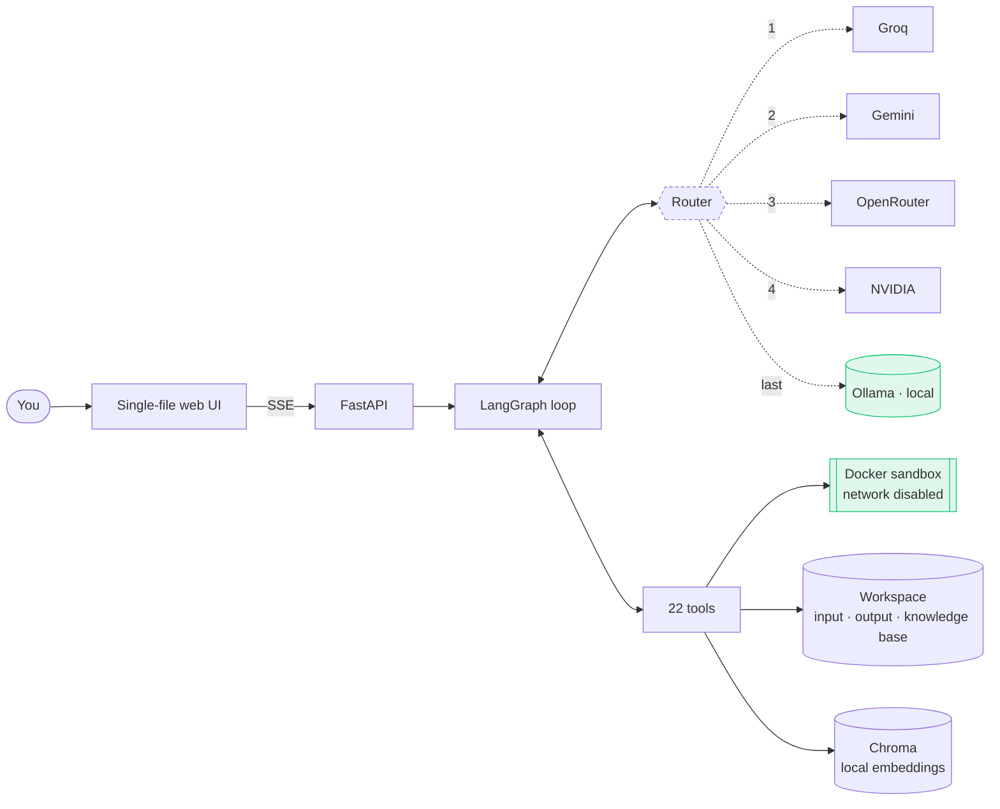

<p align="center">
  
</p>

<p align="center">
  <a href="#setup">Setup</a> ·
  <a href="#what-it-does">What it does</a> ·
  <a href="#how-it-works">How it works</a> ·
  <a href="docs/limitations.md">Limitations</a>
</p>

<p align="center">
  
  
  
  
</p>

---

An agent you run yourself. It reads your documents, executes code in a sealed
container, searches your knowledge base, browses the web read-only, and writes
the Word, Excel and PowerPoint files you actually have to hand over.

The models come from whichever free tiers you have keys for — Groq, Gemini,
OpenRouter, NVIDIA — with Ollama on your own machine at the end of every chain.
When a free tier rate-limits, the run does not stop; it moves down the chain and
keeps going. That is the whole design.

<p align="center">
  
</p>
<p align="center"><sub>One run, start to finish: a question goes in, the plan appears, each tool call runs in the open, and the file it produced is opened from disk.</sub></p>

## Why it exists

Most agent front-ends ask you to trust a summary. This one is built the other
way round: the run trace is the primary content, and the answer is what is left
once you can see how it was reached. Every tool call is on screen with its
arguments, its duration and its raw result, and every file the agent writes is
re-opened and described back from disk rather than from the code that wrote it.

<p align="center">
  
</p>
<p align="center"><sub>Every run shows its working: what it planned, which tool it called with which arguments, how long that took, and what came back.</sub></p>

It also has to be free to run all day. A single free tier is not an everyday
assistant — it is an assistant that stops working at two in the afternoon. So
roles are chains rather than choices, and the last link is a model on your own
hardware that has no quota at all.

## What it does

<table>
<tr><td width="30%"><b>Reads what you give it</b></td><td>PDFs with a text layer, scans and photographs through OCR, spreadsheets range by range, images through a vision model. Drop a file anywhere in the window.</td></tr>
<tr><td width="30%"><b>Runs code for real</b></td><td>Python in a Docker container with the network stack disabled at the kernel level, a memory cap and a wall-clock timeout. Not a sandboxed interpreter — a sealed one.</td></tr>
<tr><td width="30%"><b>Writes what you hand over</b></td><td><code>.docx</code>, <code>.xlsx</code> and <code>.pptx</code>, then reopens each file and reports its real contents — row counts, value ranges, slide titles — so the summary cannot drift from the artifact.</td></tr>
<tr><td width="30%"><b>Searches your own documents</b></td><td>A local embedding model indexes your knowledge base. Documents never leave the machine, whichever provider answers the question.</td></tr>
<tr><td width="30%"><b>Draws</b></td><td>Image generation through Gemini, saved into the workspace where the viewer, the report writer and the deck builder can all pick it up.</td></tr>
<tr><td width="30%"><b>Shows you things</b></td><td>Images open in the app, beside the conversation. Everything else opens in the application your machine uses for it.</td></tr>
</table>

<table>
<tr>
<td width="50%"></td>
<td width="50%"></td>
</tr>
<tr>
<td><sub><b>Roles are chains.</b> Each one is tried in order, free tiers first, local last. Reorder them, or drop a link.</sub></td>
<td><sub><b>Images stay in the app.</b> Arrow keys move through everything in the workspace.</sub></td>
</tr>
</table>

## How it works



The router walks a role's chain and takes the first model that answers. A rate
limit, a retired model, an auth failure or a timeout moves to the next link; a
malformed request does not, because every provider would reject it identically.

## Setup

```bash
git clone <this repo> && cd Native
python -m venv .venv && .venv/Scripts/activate     # source .venv/bin/activate on macOS/Linux
pip install -r requirements.txt
cp .env.example .env                                # then add whichever keys you have
uvicorn api:app --host 127.0.0.1 --port 8000
```

Open <http://127.0.0.1:8000>. Nothing else is mandatory — with no keys and no
Ollama the app runs and tells you what is missing, and every model chain
degrades to whatever you *do* have.

**Keys** (all optional, all free tiers — put them in `.env`):

| Variable | Provider | Get one at |
|---|---|---|
| `GROQ_KEY` | Groq | <https://console.groq.com/keys> |
| `OPENROUTER_KEY` | OpenRouter | <https://openrouter.ai/keys> |
| `NVIDIA_NIM_KEY` | NVIDIA NIM | <https://build.nvidia.com> |
| `GOOGLE_API_KEY` | Gemini | <https://aistudio.google.com/apikey> |
| `PROJECT_ID` | Gemini via Vertex | a GCP project, with `gcloud auth application-default login` |

Gemini takes either the API key or Vertex credentials; `PROJECT_ID` is what
enables image generation. Manage everything else — which model fills which
role, the fallback order, installing local models — in the **Models** panel
rather than in config files.

**Ollama** (optional) is the offline link at the end of every chain:

```bash
ollama pull qwen3:4b                    # a small generalist
ollama pull nomic-embed-text            # required for the knowledge base and memory
ollama pull qwen3-vl:4b                 # vision
```

`nomic-embed-text` is the one genuinely required model: the knowledge base and
conversation memory are embedded locally so documents never leave the machine,
whichever provider answers.

**Docker** (optional), running, with the sandbox image built — needed only for
`python_runner` and `run_ocr`:

```bash
docker build -t mrpl-sandbox-python app/tools/sandbox/python
```

`python_runner` and `run_ocr` fail at call time if this image is missing or the daemon is unreachable.

The web tools need nothing beyond `requests` — no browser, no container, no image to pull.

The build needs network access once: it installs `rapidocr-onnxruntime` (which ships the PP-OCRv4 detection and recognition models inside the wheel) and downloads the English recognition model. Both are baked into the image, so the OCR container itself still runs with `network_disabled=True`. The build asserts both are present, so a broken image fails at `docker build` rather than on the first OCR call.

**Why not Tesseract.** Measured on `sandbox_input/vessel_T18_diagram.png`, a gauge-point drawing with readings placed around a circular vessel: Tesseract recovered **3 of 8** thickness values and missed `10.9` — the lowest reading on the drawing, and the one the escalation decision turns on. PP-OCRv4 recovered **8 of 8** at 0.99 mean confidence. Tesseract also produced `Class |` and `| recommend` where the correct text is `Class I` and `I recommend`. On clean full-page scans the two are equivalent; the difference appears on rotated, sparse and diagram-embedded text, which is most of what an inspection workflow actually has to read.


Then drop reference documents (SOPs, standards, past correspondence) into `knowledge_base/`, working files into `sandbox_input/`, and run:

```bash
python main.py
```

## Documentation

| | |
|---|---|
| [Tools](docs/tools.md) | All 22, what each one takes and what it returns |
| [Architecture](docs/architecture.md) | The graph, the model layer, the file map, the sandbox |
| [Validation](docs/validation.md) | The adversarial test it was built against, and how it did |
| [Limitations](docs/limitations.md) | What is unfinished, untested, or a deliberate trade |
| [Privacy](PRIVACY.md) | What stays on your machine, and what is sent where |
| [Terms](TERMS.md) | Warranty, responsibilities, and what the output is not |
| [Contributing](CONTRIBUTING.md) | How to set up, and the one house rule |
| [Security](SECURITY.md) | The threat model, and how to report a vulnerability |
| [Changelog](CHANGELOG.md) | What changed, and when |

## Contributing

Issues and pull requests are welcome — [CONTRIBUTING.md](CONTRIBUTING.md) has
the setup, which needs no API keys at all. The one house rule is the one the
code already follows: **if you claim something works, show the run that proves
it.** A trace, a test, a before and after — something a reviewer can check.

Found a vulnerability? [SECURITY.md](SECURITY.md), privately, not a public
issue. Everyone here follows the [Code of Conduct](CODE_OF_CONDUCT.md).

## License and brand

The **code** is [Apache 2.0](LICENSE). Use it, fork it, ship it commercially —
keep the notice and state your changes. Third-party components are listed in
[NOTICE](NOTICE).

The **name and the mark** are not. "Native", the "Native by K" lockup and the
N/A monogram are reserved and explicitly excluded from that grant — see
[TRADEMARKS](TRADEMARKS.md). Fork the code freely; rename when you do.

> **On the output.** This is built on language models, and they produce
> confident, fluent, wrong answers. Nothing it writes is engineering, safety,
> legal, financial or medical advice, and it is not verified. Have a qualified
> person check anything that matters. Full text in [TERMS](TERMS.md).
