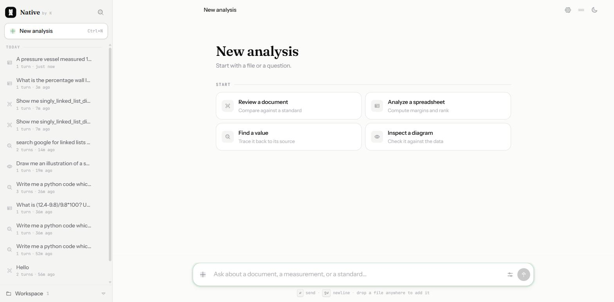

# Architecture

How the pieces fit, and why they are arranged this way.

```
api.py  ──  AgentRuntime (app/runtime/runtime.py)
              └─ LangGraph StateGraph, checkpointed to SQLite per session:

                   START → call_model ─┬─(tool_calls)→ tools (ToolNode) → call_model
                                       ├─(stalled)→ nudge → call_model
                                       └─(none)→ END

                 One turn ends when the model stops asking for tools — unless
                 it stopped without finishing, which is what the nudge branch
                 is for. The conversation itself lives in the checkpointer,
                 keyed by session_id, so a turn is stateless and a reload is
                 not.

                 delegate_to_coding_model runs a second, self-contained graph
                 (app/tools/sub_agents/coder.py) with its own four-tool subset:

                   START → model ─┬─(tool_calls & steps < CODER_MAX_STEPS)→ tools → model
                                  └─(else)→ END → final text back to the parent tools node
```

## Models

Four roles, each an ordered chain. These are the defaults; change them in the
Models panel, not in a file.

| Role | Needs | Default chain |
|---|---|---|
| **Base** — orchestrates the run | `tools` | Groq `gpt-oss-120b` → Gemini 2.5 Flash → Groq `qwen3.8-27b` → local `qwen3:4b` |
| **Coder** — the delegated subagent | `tools` | Groq `gpt-oss-120b` → Gemini 2.5 Flash → local `qwen2.5-coder-tools:7b` |
| **Vision** — reads images | image input | Gemini 2.5 Flash → local `qwen3-vl:4b` |
| **Image** — draws | image output | Gemini 2.5 Flash Image |
| Embeddings | — | local `nomic-embed-text`, always, never remote |

Two findings worth recording, both measured rather than assumed:

The stock `qwen2.5-coder` tags emit tool calls as plain text inside `<tool_call>`
tags rather than through Ollama's structured tool-calling API, so
`response.tool_calls` comes back empty and the subagent silently never executes
anything. The community `hhao/` build does it properly. Diagnosed by isolating
the model call outside the graph.

Small local models cannot orchestrate this many tools. With a 4B and a 7B model
in the base role, the agent wrote its tool calls out as JSON prose in the reply
instead of calling them. The same prompt through Groq's `gpt-oss-120b` calls the
tool and reports the result. Local models are a viable last link in a chain, not
an everyday orchestrator — which is why the chain exists.

## Files

- **`app/runtime/state.py`** — `AgentState` TypedDict holding the message list.
- **`app/runtime/runtime.py`** — graph nodes, the `AgentRuntime` class, context-window management, and per-call logging. One `.run()`/`.stream()` call is one turn; conversation state lives in a LangGraph SQLite checkpointer keyed by `session_id`.
- **`app/runtime/sessions.py`** — `SessionStore`: session metadata (id, title, timestamps, turn count) in the same on-disk SQLite file. Titles a session from its first message.
- **`app/config/prompts.py`** — `SYSTEM_PROMPT`, the full tool-use operating rules. Prepended at call time, never stored in state.
- **`api.py`** — FastAPI service: `/sessions` CRUD, `/chat` (blocking) and `/chat/stream` (SSE, one event per model/tool step), `/health`, and `/` which serves the web UI. Started by `native start`, which is `uvicorn api:app` with the browser opened for you.
- **`steel.py`** — the live browser's plumbing: the Steel session, the one thread that owns Playwright (its sync API is thread-affine and tool calls arrive on a pool), and the JavaScript that numbers a page's interactive elements. **`livebrowser.py`** — the two tools built on it.
- **`install.py`** — one-command setup. Seven steps in dependency order, each checking before it acts so a re-run repairs what is missing and leaves the rest alone. Only the first four are required; a failure in Ollama, Docker or Steel is reported and stepped over, because a partial install that says exactly what it got beats one that dies at Docker and leaves you guessing whether the Python side worked. It is Python rather than a shell script because Python is the one thing already guaranteed present, and three drifting shell scripts is the alternative. It also writes Steel's launcher, which is where the `npm run dev -w api` workaround is encoded rather than left in a README for someone to miss.

- **`cli.py`** — the `native` command, installed as a console entry point by `pyproject.toml`: `start` runs the service, `chat` is an interactive REPL over one persistent session. **`main.py`** — single-shot run of the validation task.
- **`frontend/index.html`** — the web UI (below). Single self-contained file, served same-origin by `api.py`.
- **`app/models/base.py`** — orchestrator model with all registered tools bound.
- **`app/models/base.py`** — orchestrator model with all registered tools bound.
- **`app/models/coder_model.py`** — code-specialist model bound to a tool subset (`python_runner`, `read_pdf`, `read_text_file`, `list_sandbox_files`).
- **`app/models/vision_model.py`** — `ollama.chat` wrapper for image questions.
- **`app/tools/sub_agents/coder.py`** — `CoderAgent`: its own compiled graph, `CoderState` with a step counter, its own system prompt, and `[coder]`-prefixed step logging.
- **`app/tools/sub_agents/vision.py`** — `run_through_vision_model`; resolves a filename against the sandbox, base64-encodes, calls the vision model.
- **`app/tools/delegate_to_subagent.py`** — `delegate_to_coding_model`; fresh `CoderAgent` per call. The subagent sees only the task string, never the parent conversation.
- **`app/tools/registery.py`** — tool name → tool object registry.
- **`app/tools/sandbox/python/python_runner.py`** — Docker-sandboxed execution. Client created lazily so importing the registry doesn't require a running daemon.
- **`app/tools/sandbox/python/Dockerfile`** — the `mrpl-sandbox-python` image.
- **`app/tools/browser.py`** — `web_search` and `browse_web`. Each now tries the live browser first (`liveweb.py`) and keeps its original implementation — plain `requests` plus a regex HTML-to-text pass — as the fallback for when Steel is not running. The two tools kept their names and signatures deliberately: the model's routing, the system prompt and research mode all upgrade without knowing anything changed. The cost of the fallback path is unchanged and so is its limitation, that a client-side page comes back thin.
- **`app/tools/authoring/`** — the three file generators. `blocks.py` holds the block spec they share and its parser, which accepts either JSON text or an already-decoded list because local models are inconsistent about which they send, and which pads ragged table rows rather than failing a whole document over a missing trailing cell. `document.py`, `spreadsheet.py` and `presentation.py` each render, save, then **reopen the saved file and report its real contents** — paragraph and table counts, per-column value ranges, slide titles. The agent's own account of a file it generated is a description of intent; this is a description of the artifact.
- **`app/tools/readback.py`** — the same idea for files the agent did not author through those tools. `snapshot`/`changed_since` diff `/sandbox/output/` around a `python_runner` call, and `describe` opens whatever appeared — xlsx, docx, pptx, pdf, image, text — so a script that wrote a different spreadsheet than the agent believes it wrote is caught in the tool result rather than in the user's inbox.
- **`app/tools/desktop.py`** — `open_on_screen`. `webbrowser.open` for URLs, `os.startfile` / `open` / `xdg-open` for files. All four hand the target to the OS's file-association machinery rather than to a shell, so a filename can never be read as a command; only `http`/`https` URLs are accepted, since any other scheme is a way to make some other application run.
- **`app/tools/workspace.py`** — `clear_workspace`. Empties every table in `agent.db` rather than a named list of them: the transcripts live in LangGraph's checkpointer tables, whose names and number are its business and have changed across versions, and anything in that file is chat history by definition. Also drops the persistent `history` Chroma collection, the in-process knowledge base index (`rag.indexed = False`, so it rebuilds on the next search), and the runtime's live per-session `context_manager` objects — imported lazily inside the function, because the runtime imports the registry which imports this module.
- **`app/tools/ocr.py`**, **`io.py`**, **`pdf_info.py`**, **`excel_info.py`**, **`sandbox_files.py`**, **`rag.py`**, **`math.py`** — the remaining tools.
- **Context is three tiers.** Assembled in `call_model` on every turn, in the order the model should trust them:

  | Tier | What | Where | Scope |
  |---|---|---|---|
  | 1 · working set | the last N messages verbatim, tool calls still paired with their results | the checkpointer | 30 messages (60 in research mode) |
  | 2 · session record | everything in this session that has scrolled out of tier 1, folded into a running summary | `digest` table in `agent.db` | this session |
  | 3 · long-term | turns embedded and recalled by similarity | Chroma `history` collection | every session on the machine |

  Tier 2 is what closes the gap between the other two. Tier 3 is queried by similarity against the latest message, so it surfaces what *resembles* the current question and knows nothing about what merely happened recently — the twelfth source of a research run comes back only by luck. Without tier 2, a long run repeats searches it has already done and writes its final answer from the last few pages plus a vague memory of the rest.

- **`app/runtime/digest.py`** — tier 2. Folding is incremental: only messages that have newly left the working set are summarised, and they are folded into the existing summary rather than re-read from the top, so a two-hundred-step run costs the same per fold as a ten-step one. `MIN_FOLD` holds the fold back until enough has accumulated, because summarising one message at a time is both a model call per step and a summary of a summary. The summariser is invoked with no tools bound — it records what happened, it does not act — and a failed fold keeps the previous digest rather than raising, because a turn that dies building its own context is worse than one with a slightly stale record.

- **`app/tools/steel.py`** — the live browser's plumbing. **`app/tools/livebrowser.py`** — `browser_do` and `browser_page`. **`app/tools/liveweb.py`** — the rendered implementations of `web_search` and `browse_web`: `browser.py` calls these first and falls back to its own plain-HTTP path when they return `None`, which they do for exactly one reason, the live browser being unavailable. A page that genuinely failed returns its error instead, because silently refetching it over HTTP would hide the reason and hand back a thinner copy of the same failure. Reads happen in a scratch tab, so looking something up never navigates the tab a half-filled form is sitting in.

- **`app/config/context_manager.py`** — tier 3: conversation memory in a persistent Chroma collection. Tool results are excluded from the embedding store: they're large, task-local, and re-fetchable, and surfacing a stale one as current fact is a direct hallucination vector.
- **`app/config/settings.py`** — `RAG_MODEL`, `CODER_MODEL`, `CODER_MAX_STEPS`, `TOOL_MAX_RETRIES`.

## Context management

**Stalling.** A turn used to end on any reply without a tool call, which is right when the model has answered and wrong when it has only *described* the call it was about to make — `ACT: I will now browse the repository` with no `browse_web` attached. The graph could not tell those apart, so a narrated action ended the run and the user watched the agent stop mid-plan. An empty reply was the same failure with nothing left over. The CHECK/PLAN/ACT prompt makes this likelier rather than less: the model writes ACT as prose and treats having written it as having acted.

So `tool_call_check` now asks a second question. A reply with no tool call that ends on an unfulfilled intent — or has no text at all — routes to `nudge`, which appends a short instruction saying the step was described but not taken, and sends it back to `call_model`. `MAX_STALLS` bounds it at three per turn and a real tool call resets the counter, so a stalling model is pushed back a few times but can never spin there. Two details that are not optional: the branch scans backwards for the last **AI** message rather than reading `messages[-1]`, because the nudge itself is the tail by then; and the turn's answer comes from `final_answer()` for the same reason, or a run that exhausted its nudges would hand the user the nudge text as its reply. The nudge is filtered out of the run trace in both the blocking and streaming paths — it is plumbing, not a step.

`call_model` keeps a contiguous window of recent messages rather than assembling a synthetic one. This matters more than it sounds: an `AIMessage` carrying `tool_calls` must stay adjacent to the `ToolMessage` answering it, or the history becomes structurally invalid and models respond to the malformed context with confident fabrication. The window also pins the system prompt separately, so the operating rules don't fall out of context exactly when a conversation gets long enough to need them.

Every model call logs the exact context it received — message count, type breakdown, approximate token count, and a one-line preview of each message with its tool-call linkage. This is what makes it possible to tell "the model reasoned badly" apart from "the model never received the data."

## Interfaces

<p align="center">
  
</p>
<p align="center"><sub>Light and dark are both designed rather than inverted — six neutral steps each, so panels separate without relying on borders.</sub></p>


Three ways in, all on the same `AgentRuntime` and the same on-disk SQLite state:

- **`native`** (or `native start`) — the HTTP service and the web UI, opened in a browser at `http://127.0.0.1:8000/`. `--host`, `--port`, `--no-browser` and `--reload` adjust it.
- **`native chat`** — interactive REPL, one persistent session, no web UI.
- **`python main.py`** — runs the validation task once and prints the answer.

The web UI is a single static file (`frontend/index.html`) served same-origin by the API, so streaming needs no CORS and no build step. It shows the run sidebar, the live tool trace (each call with its arguments, result, status, and client-measured duration), and the final answer. Nothing in it talks to anything but the local API.

**Brand.** The mark is an N/A monogram: a solid N with the A cut out of it by a hairline gap, and a single green counter in the A's apex. That green — `#0bc26a` — is the brand colour and the source of the interface accent, not a separate decision made next to it. The UI does not ship two artworks: the badge behind the mark supplies the ground the knockout needs, so the same paths read correctly on a near-black badge in light mode and a near-white one in dark. Light mode darkens the green to `#0a8f4e` so it holds against white at icon scale; dark mode uses it exactly as drawn. Source files are in `Logos/`.

**Providers.** Five lanes, all on free tiers: **Groq** (fast, a short list of large models), **Gemini** (API key, or Vertex credentials if `gcloud` is already logged in — which is how this machine is set up), **OpenRouter** (widest choice, and the only provider publishing real per-model capability data; its `:free` variants cost nothing), **NVIDIA NIM**, and **local Ollama**. Discovery is live against each provider's own API — 500-odd models here, about a hundred of them free and tool-capable. Ollama and OpenRouter *report* capabilities; the rest are inferred from the model id and flagged unverified in the panel rather than presented as fact.

One wrinkle worth recording: Groq's `/models` endpoint sits behind Cloudflare, which rejects a bare `urllib` request with error 1010 while accepting the SDK's client. The SDK is the only way in.

**Roles are chains, not choices.** This is the design decision the whole thing turns on. Free tiers rate-limit exactly when you lean on them, so a single free model as a hard dependency is an assistant that stops working at two in the afternoon. Each role holds an ordered chain; the first link that answers wins; a quota error, a retired model, an auth failure or a timeout falls through to the next. Local Ollama sits at the end of every chain — slowest and smallest, and the only link that still works with the network off.

Failure is classified before it is retried. A rate limit, dead model, auth problem or outage means *ask someone else*. A context-length overrun or a malformed request means the request is wrong and every provider will say so, so it is raised immediately rather than repeated four times. When every link fails, the error names all of them, because one message listing five real failures beats whichever happened to be last.

**Image generation** is a fourth role, deliberately separate from vision — reading a picture and drawing one are different skills and almost no model does both, so they are different capability flags rather than one "multimodal" bucket. `generate_image` writes a real PNG into `/sandbox/output/`, which means everything already built for images picks it up for nothing: the viewer shows it, `write_document` and `create_presentation` embed it by name, `run_through_vision_model` can be pointed back at it.

The model is Gemini on Vertex (`gemini-2.5-flash-image`), reached through `generate_content` with image output. Imagen was the first choice and is not enabled on this project — all three Imagen tags 404 in both `us-central1` and `global` — so the Gemini image model is the default. OpenRouter's image models are detected too, via `output_modalities`, but none of them are free.

Two honest limits. The aspect argument is a hint: the endpoint takes no ratio parameter, so it is asked for in words, and a request for landscape measurably came back 1024×1024 — the read-back reports the size actually produced rather than the size requested. And this is the one chain with no local link, because nothing in Ollama's catalogue generates images; it is the part of the system that genuinely stops working offline.

The prompt is explicit that a chart is plotted with `python_runner`, never drawn: a generated picture of a chart shows invented numbers and looks convincing, which is worse than no chart.

**Capabilities still gate roles.** `base` and `coder` require `tools`; `vision` requires image input. The panel only offers models that qualify and the API refuses the rest by name. Residency management now applies only to the local link: a cloud model holds no VRAM, so switching to one releases whatever Ollama was keeping.

**A note on DeepSeek R1 14B.** Ollama lists `thinking` for `deepseek-r1:14b-qwen-distill-q4_K_M` and does not list `tools`, so it cannot orchestrate. This was measured, not assumed: with a 4B and a 7B local model as base, the agent wrote its tool calls out as JSON prose instead of calling them. Through Groq's `openai/gpt-oss-120b` the same prompt calls `calculate` correctly and reports the answer. Small local models are viable as the last link in a chain, not as the everyday orchestrator.

**Streaming.** The runtime streams in two LangGraph modes at once. `updates` yields the completed message at the end of each node — that is what the run trace is built from and what stays authoritative. `messages` yields the model's tokens as it produces them, emitted as `token` events, filtered to the `call_model` node so a tool that runs its own model (the coding subagent does) cannot pour its private reasoning into the answer. Token events are deliberately advisory: every one is superseded by the `message` event for the same node, so a client that ignores them entirely still renders a correct transcript. Tokens streamed before the model decides to call a tool were thinking aloud rather than an answer, and are re-seated as a note.

In the UI, re-parsing the whole answer per token would work and would also be wrong: it rebuilds the DOM ~25 times a second, destroying any selection the reader has made and re-running syntax highlighting on finished code. Markdown is block-structured and only the last block is still being written, so the buffer is lexed, every block but the last is committed once and never touched again, and only the tail re-renders. The lexer is what makes that safe — a blank line inside a fenced code block is not a block boundary. Painting is scheduled by rAF *and* a 120 ms timer, whichever fires first: rAF is the right clock for something being painted, but Chrome suspends it in a hidden tab, and an answer arriving while the user is in another tab must still be laid down.

**Images, in the app.** `GET /files/{location}/{name}` serves anything in the three sandbox directories. The name is reduced to its basename before use and the resolved path is re-checked to be inside the directory it claims, so neither a crafted name nor a symlink already in the folder can escape; SVG is served as an attachment rather than inline, because an SVG is a document that can carry script. A markdown image in an answer becomes a figure resolved out of the workspace; images a step produced appear as thumbnails inside that step in the trace; the workspace list gets a preview verb next to the attach verb. All of it opens an in-app viewer with arrow-key navigation across every image the workspace holds. `open_on_screen` still exists for when the user wants the file in their own application — that is now a choice rather than the only route.

**Motion.** The rule is that motion is a by-product of real state changing, never an ornament on a loop. A committed block of prose fades up once as it lands; the tail is excluded, because it re-renders every frame and would shimmer. The caret is a steady green rule that rides the end of the text rather than a blinking block borrowed from a terminal. The trace rail draws downward as steps arrive, a completed step emits one ring, and the segment bar takes a single sweep of light when the run ends. The green counter inside the monogram — three pixels of brand — breathes only while a turn is running and flashes once when one lands; nothing else in the chrome moves. Everything is gated behind `prefers-reduced-motion`.

**Icons.** [Phosphor](https://phosphoricons.com) (MIT), duotone weight. Duotone is two filled paths — a shape at 20% opacity beneath the detail, both `currentColor` — which is why an icon costs nothing to tint: the wash inherits the same colour the glyph does, so a spreadsheet reads as green in two densities rather than one. Markup asks for an icon by name through a slot (`<i class="ig" data-ico="…">`) that a boot pass fills from the registry, so there is one set in one place instead of a registry plus two dozen copies pasted into the HTML.

**Type.** Three registers, and the split is what keeps the character from becoming costume. **Fraunces** is the display face — the wordmark, the opening line, and headings inside an answer, which is to say the few places the product is speaking rather than labelling. It is drawn rather than engineered, with `SOFT` and `WONK` axes that round the terminals and let a few letters sit fractionally off-square; both are set near the bottom of their range, because low it reads as a human hand and high it reads as a novelty face. **Instrument Sans** is the workhorse and stays sober, since it is what gets read for hours. **JetBrains Mono** is the instrument panel: filenames, durations, tool names, anything measured. Handcraft belongs to the first register only — the other two earn their keep by not competing with it.

**Visual language.** Neutral first: roughly 93% of any screen is a six-step grey ramp, and hierarchy is carried by weight, size and surface before colour is considered. The remaining sliver is semantic and never decorative — green is the accent (active, focused, selected, complete, and tabular data, since working through data is what the tool is for), blue is documents, violet is images and diagrams, amber is measurements needing attention, red is failure. Each appears at the scale of a 5px dot or a 14px icon; a hue filling an area larger than an icon is a hue being misused. One function decides both the glyph and the tint for a file, so a spreadsheet is the same green table in the rail, the composer chip and the message attachment — that consistency is what lets colour read as a type rather than as emphasis.

Dark mode is designed rather than inverted, and deliberately not near-black: the ground sits at `#101114` so panel, card and hover can each be a couple of luminance steps above it and still separate. A black ground forces every boundary onto a border, which is what makes most dark themes look flat.

Running and complete are both green, so the run trace distinguishes them the way a dial does — a thin arc sweeping while a tool runs, a solid core once it lands. Motion and shape carry the state; the hue only says whose work it is.

## Verifying the sandbox

The isolation guarantees are checkable by hand, and worth checking rather than trusting:

```bash
# No network: fails at DNS resolution, not at connection
docker run --rm --network none python:3.11-slim \
  python3 -c "import urllib.request; urllib.request.urlopen('https://google.com')"

# Memory cap: kernel OOM-kills the process, exit code 137
docker run --rm --memory 50m python:3.11-slim \
  python3 -c "x = bytearray(200*1024*1024)"; echo $?
```

The first fails with `socket.gaierror: [Errno -3] Temporary failure in name resolution` — the container has no network interface at all, so it can't even attempt a lookup. The second returns 137 (128 + SIGKILL), meaning the kernel killed it for exceeding its cgroup limit rather than the process choosing to stop.

Both hold when the *model* is the one generating the code. Asked to fetch a URL through `python_runner`, the agent writes correct networking code, runs it, and gets the same DNS failure back as a tool result.

---

[← Back to the README](../README.md)
